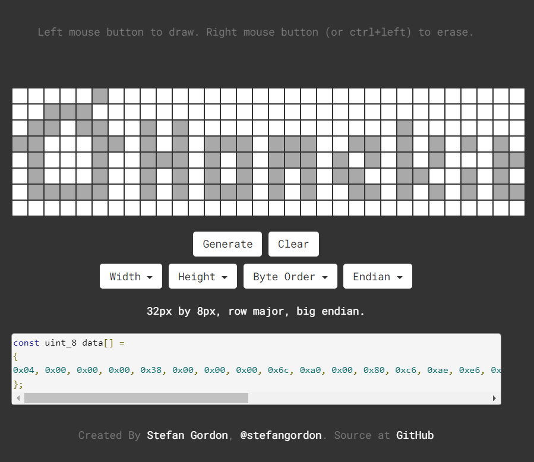

# esp32-Awtrix-with-homekit
## 說明
esp32 的像素鐘，硬件來自[yinbaiyuan](https://github.com/yinbaiyuan)，[長這樣](https://www.youtube.com/watch?v=WN7-ERU2oeI&t=1s&ab_channel=%E5%88%9B%E5%AE%A2%E5%B0%B9%E7%99%BD%E7%8C%BF)，能在他本人淘寶買到。買回來之後把軟件玩壞了，只好自己重寫。。。

- [x] GFX
- [x] 自動對時
- [x] 接入 homekit，RGB調光
  - [Homespan](https://github.com/HomeSpan/HomeSpan) 
    - [UserGuide](https://github.com/HomeSpan/HomeSpan/blob/master/docs/UserGuide.md)
- [ ] 讓 Homespan 用戶功能正常
  - 目前只能用命令行配網
  - [ ] Webserver 設置

## 畫LED Matrix
推薦Stefan Gordon的 [Dot Matrix Tool](http://dotmatrixtool.com/#)

